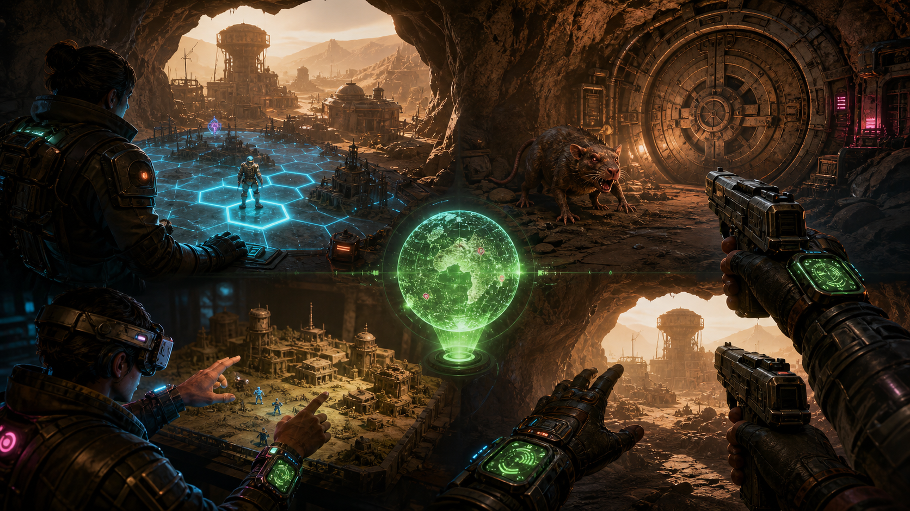
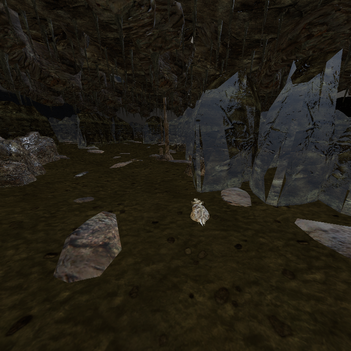
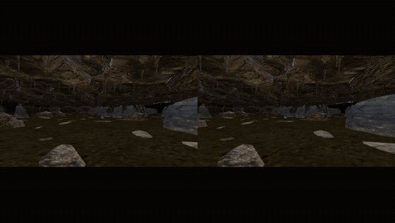
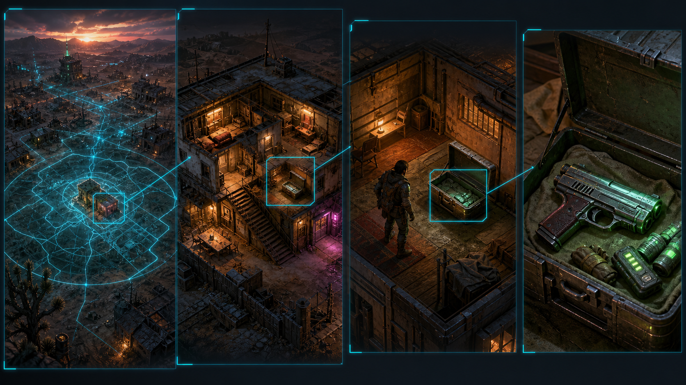
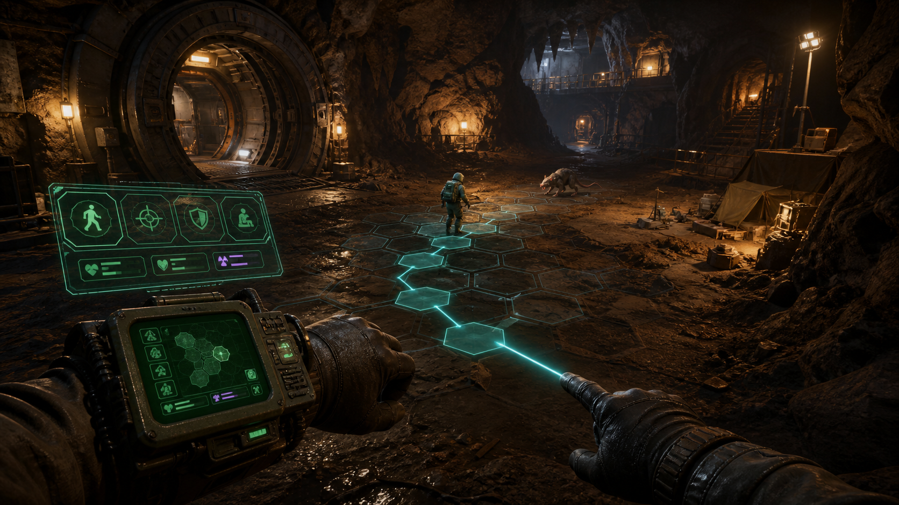

# PROJECT VAULTGLASS

## Universal multimode wasteland RPG — vision, architecture, proof, and vertical-slice contract

> **Working design dossier · 25 August 2026 · private owned-data research concept · clean-room/public-release status unresolved · not affiliated with or endorsed by Bethesda, Interplay, or their partners**

**🟡 CONCEPT ART — NOT IN ENGINE**

### The promise in one sentence

Build **one persistent role-playing world** that can be played as faithful turn-based hex tactics, a desktop first/third-person action RPG, a world-stable VR tactical command table, or an embodied first-person VR game—without duplicating the character, item, quest, combat, or save-game truth.

| Legend | Meaning |
|---|---|
| 🟢 **VERIFIED** | A concrete artifact exists and was inspected. |
| 🟡 **CONCEPT / PARTIAL** | Some scaffolding exists, but the complete claim is not proven. |
| 🔴 **NOT YET PROVEN** | This remains an implementation and acceptance target. |
| 🟣 **OWNED-DATA ONLY** | Imported locally from a player's legally owned installation; never bundled in a public asset-free build. |

> [!IMPORTANT]
> The artwork in this dossier is **concept art**, not a screenshot. The animated cave clip below is **real simulator output**, but it is not physical-headset proof. Every section keeps those categories separate.

> [!CAUTION]
> **STATUS: G0 SOFTWARE-RENDER EVIDENCE ONLY.** The embedded cave media is a private owned-data OpenXR-simulator capture. It is not a physical-headset, interaction, visual-parity, shared-state, campaign, or public-release proof. Sections 2–14 are normative architecture and acceptance targets. The authoritative cross-mode world core, FO1 action mode, interactive tactical VR, embodied VR rig, campaign conversion, and autonomous campaign agents are not implemented.

> [!WARNING]
> **PROVENANCE HOLD.** The current R42 slice is a private, owned-data, Fo1in2-assisted prototype using locally imported FNV presentation donors. Fo1in2 scripts and modified-engine behavior are not presently admitted as Fallout 1 retail-parity authority. Before any “exact Fallout 1” claim, each fact must be independently grounded in owned retail data, published format facts, or recorded retail behavior—or the work must be explicitly maintained as a separate Fo1in2 compatibility profile under its applicable license. Current media remains private until a public-media and rights audit passes.

### The first 90 seconds we are building

~~~mermaid
%%{init: {"theme": "base", "themeVariables": {"background": "#080c13", "fontFamily": "Segoe UI", "primaryTextColor": "#ffffff", "lineColor": "#70d6ff"}}}%%
flowchart TB
    A["CREATE / LOAD CHARACTER"]:::green --> B["PLAY OR SKIP retain final door reveal"]:::amber
    B --> C["CONTROL BEGINS IN CAVE look back: open Vault 13 look forward: dead dweller + route"]:::cyan
    C --> D["ACTION MODE kill two locally alerted rats"]:::orange
    D --> E["LEAVE COMBAT switch to tactical"]:::red
    E --> F["SAME ACTOR + CORPSES + AMMO toggle legal hex overlay command the pawn"]:::blue
    F --> G["ENTER ONE ROOM chest → pistol → shelf"]:::purple
    G --> H["SAVE / RELOAD repeat handshake in VR"]:::green

    classDef green fill:#35f2a1,stroke:#d8ffee,color:#03170e,stroke-width:3px;
    classDef amber fill:#ffd166,stroke:#fff0b6,color:#211600,stroke-width:3px;
    classDef cyan fill:#72efdd,stroke:#d7fff9,color:#05201d,stroke-width:3px;
    classDef orange fill:#ff9f1c,stroke:#ffe0ad,color:#201000,stroke-width:3px;
    classDef red fill:#ff4d6d,stroke:#ffc6d0,color:#260208,stroke-width:3px;
    classDef blue fill:#00c2ff,stroke:#b9efff,color:#03141b,stroke-width:3px;
    classDef purple fill:#d05cff,stroke:#efc4ff,color:#21052a,stroke-width:3px;
~~~

---

## 1. The living proof we have now

### 🟢 Engine-native OpenXR simulator-path baseline

> **🔴 CURRENT XR BASELINE — G1 VISUAL FIDELITY OPEN.** This verifies simulator eye submission and capture. It does not prove correct Vault 13 staging, finished cave geometry, enemy readability, interaction, or physical-headset comfort.

**Final single-eye still**

**Animated engineering capture**

**Mobile MP4:** [Open the 960×540 H.264 proof video](assets/vault13-vr-simulator-proof.mp4)

**Stereo frame:** [Open the side-by-side frame](assets/vault13-vr-simulator-sbs.png)

**Single eye:** [Open the final left-eye still](assets/vault13-vr-simulator-single-eye.png)

The capture driver sampled 64 native both-eye D3D12/OpenXR simulator projections at 8 fps. Those samples were encoded into an 11-second, 24-fps H.264 presentation file containing 264 encoded frames, followed by a three-second left-eye hold.

What it proves:

- 🟢 the current cave scene travels through the engine’s D3D12/OpenXR simulator path and produces both eye images;
- 🟢 the proof package contains stereo and single-eye output;
- 🟢 the scene report identifies an open door, an XRCamera3D, world scale 1.0, and a passing simulator status;
- 🟢 the clip can be opened as a small H.264 mobile file or viewed inline as a GIF.

What it **does not** prove:

- 🔴 physical-headset comfort or stereo correctness;
- 🔴 tracked hands, weapon grip, wrist-device interaction, or controller input;
- 🔴 the complete Fallout 1/2 campaign;
- 🔴 one shared state across tactical and action modes;
- 🔴 final art, final lighting, or retail visual parity.

### Inspected local-artifact ledger

| Artifact | Fact | Verification |
|---|---|---|
| FO1 V13ENT scene manifest | Spawn tile **17690**, door tile **16290**, **20 source mobs** | 🟢 Present in the current private slice |
| R42 topology accounting | **30,196** floor-backed hexes; **29,127** provisionally walkable after decoded object flags; **27,519** overlay hexes drawn after **1,608** additional presentation-footprint masks | 🟢 Counts inspected; **not** complete Fallout walk-mask or multihex parity |
| Tactical session count | Session report separately records **27,520 provisional walkable hexes** | 🟡 One-count discrepancy remains an evidence issue |
| Scene manifest SHA-256 | <code>fdd490db24623a9e173e540010e335e3e96e8da2074869741febf36084a897d1</code> | 🟢 Recorded |
| Mobile OpenXR proof | 11 s, H.264 Main, 960×540, yuv420p, 905,504 bytes | 🟢 Embedded above |
| Mobile proof SHA-256 | <code>fc99695fe1d76a058f2299375a2fc32ecf9ffeb01a09eb3220cb61b0e326db3a</code> | 🟢 Recorded |
| Headset acceptance | Physical headset tested and passed | 🔴 False |
| Interaction acceptance | Hands, weapon, wrist UI, tactical ray | 🔴 False |

The manifest explicitly leaves complete Fallout walk masks and complete <code>OBJECT_MULTIHEX</code> footprints unsupported. One metre per hex is a reconstruction convention, not recovered retail metric truth.

**Sanitized evidence summaries:** [engine report](evidence/engine-report-sanitized.json) · [capture-driver report](evidence/driver-report-sanitized.json) · [tactical report](evidence/tactical-report-sanitized.json)

> **Reproducibility hold:** these are inspected artifacts, not a clean reproducible build. The producing repository is currently dirty. A clean source commit or content-addressed source/patch snapshot, executable/importer/Godot/OpenXR runtime hashes, exact invocation, machine summary, and one-command verifier are still required.

---

## 2. The product is a matrix, not four separate games

> 🟡 **NORMATIVE DESIGN TARGET:** Sections 2–14 define what the implementation must eventually satisfy. Except where an evidence row explicitly says otherwise, present-tense shorthand below is a contract—not a statement of current capability.

The rules/control style and the presentation device are **orthogonal axes**.

|  | **Desktop** | **VR** |
|---|---|---|
| **Tactical rules** | Faithful isometric/Kenshi-style commander camera; pan, orbit, zoom; exact legal hexes; turn/AP scheduler | Full-scale or tabletop commander view; head remains world-stable; hand ray selects a legal tile; the pawn walks there |
| **Action rules** | First- or third-person movement, aiming, gunplay, interaction, dialogue, and a diegetic Pip-Boy | Embodied FPS with tracked hands/forearms, authored weapon grips, haptics, and a readable wrist device |

~~~mermaid
%%{init: {"theme": "base", "themeVariables": {"background": "#0b0f18", "fontFamily": "Segoe UI", "primaryTextColor": "#f7f7ff", "lineColor": "#70d6ff"}}}%%
flowchart LR
    T["TACTICAL turns · AP · hex authority"]:::tactical
    A["ACTION continuous motion · aiming"]:::action
    D["DESKTOP mouse · keyboard · controller"]:::desktop
    V["VR head · hands · world-space UI"]:::vr

    T --> TD["Tactical Desktop classic / Kenshi lens"]:::out
    D --> TD
    A --> AD["Action Desktop FPS / third person"]:::out
    D --> AD
    T --> TV["Tactical VR commander / tabletop"]:::out
    V --> TV
    A --> AV["Action VR embodied FPS"]:::out
    V --> AV

    classDef tactical fill:#00c2ff,stroke:#9be7ff,color:#04131d,stroke-width:3px;
    classDef action fill:#ff9f1c,stroke:#ffd08a,color:#1c0d00,stroke-width:3px;
    classDef desktop fill:#35f2a1,stroke:#b6ffdf,color:#04160f,stroke-width:3px;
    classDef vr fill:#d05cff,stroke:#efb6ff,color:#1b0623,stroke-width:3px;
    classDef out fill:#161d2b,stroke:#f7f7ff,color:#f7f7ff,stroke-width:2px;
    linkStyle default stroke:#70d6ff,stroke-width:2px;
~~~

**Target contract:** the player may mix and match the four cells. The game must not fork into four saves or silently clone the world.

---

## 3. North star: one truth, many lenses

~~~mermaid
%%{init: {"theme": "base", "themeVariables": {"background": "#080b12", "fontFamily": "Segoe UI", "primaryTextColor": "#ffffff", "lineColor": "#92f7c7"}}}%%
flowchart TB
    OWN["🟣 LEGALLY OWNED LOCAL DATA records · cells · art · audio · dialogue"]:::owned
    IMP["DETERMINISTIC LOCAL IMPORTER read-only sources · disposable cache · manifests"]:::importer

    DEF["IMMUTABLE CONTENT DEFINITIONS namespaced keys · profile versions"]:::definition

    subgraph CORE["AUTHORITATIVE DURABLE WORLD CORE"]
        CMD["SEMANTIC COMMAND command ID · expected revision · payload"]:::command
        RES["PROFILE VALIDATE + RESOLVE authoritative tick · recorded RNG outcome"]:::resolver
        EVT["APPEND DOMAIN EVENTS one commit boundary"]:::event
        STATE["REDUCE TO WORLD STATE entities · inventory · doors · quests ownership · corpses · time"]:::core
        SAVE["VERSIONED SNAPSHOT + EVENT CURSOR"]:::save
        CMD --> RES --> EVT --> STATE
        EVT --> SAVE
        SAVE -. "load / migrate" .-> STATE
    end

    subgraph RULES["BESPOKE RULE PROFILES"]
        H12["FO1 / FO2 hex + turn canonical"]:::classic
        NV["FO3 / FNV continuous world canonical"]:::modern
        F4["FO4 later, separate complexity profile"]:::future
    end

    subgraph VIEWS["PRESENTATION + INPUT ADAPTERS"]
        DT["Desktop Tactical"]:::tactical
        DA["Desktop Action"]:::action
        VT["VR Tactical"]:::vr
        VA["VR Action"]:::vr
    end

    OWN --> IMP --> DEF
    DEF --> H12
    DEF --> NV
    DEF --> F4
    H12 --> RES
    NV --> RES
    F4 --> RES
    DT --> CMD
    DA --> CMD
    VT --> CMD
    VA --> CMD
    STATE --> DT
    STATE --> DA
    STATE --> VT
    STATE --> VA

    classDef owned fill:#6f2dbd,stroke:#e0b3ff,color:#ffffff,stroke-width:3px;
    classDef importer fill:#283044,stroke:#9aa8c8,color:#ffffff,stroke-width:2px;
    classDef definition fill:#6f2dbd,stroke:#e0b3ff,color:#ffffff,stroke-width:3px;
    classDef core fill:#35f2a1,stroke:#d7ffec,color:#04140d,stroke-width:4px;
    classDef command fill:#00c2ff,stroke:#b9efff,color:#03141b,stroke-width:3px;
    classDef resolver fill:#ff9f1c,stroke:#ffe0ad,color:#201000,stroke-width:3px;
    classDef event fill:#ffd166,stroke:#fff1bd,color:#201500,stroke-width:3px;
    classDef save fill:#b5179e,stroke:#f2b8e9,color:#ffffff,stroke-width:3px;
    classDef classic fill:#72efdd,stroke:#d5fff8,color:#05201d,stroke-width:2px;
    classDef modern fill:#ff9f1c,stroke:#ffe0ad,color:#201000,stroke-width:2px;
    classDef future fill:#ff4d6d,stroke:#ffc1cc,color:#250208,stroke-width:2px;
    classDef tactical fill:#00c2ff,stroke:#b9efff,color:#03141b,stroke-width:2px;
    classDef action fill:#ff9f1c,stroke:#ffe0ad,color:#201000,stroke-width:2px;
    classDef vr fill:#d05cff,stroke:#efc4ff,color:#21052a,stroke-width:2px;
~~~

### The indivisible state—per campaign instance

**Target contract:** one authoritative instance exists per active campaign. This does not mean merging FO1, FO2, FNV, and FO4 into one save. A small shared kernel carries stable semantics; each profile adds versioned, namespaced components and content definitions.

Every meaningful runtime instance must have one stable identity:

- an actor has one runtime instance ID, namespaced prototype key, SPECIAL/stat block, equipment relationships, health value, faction, AI state, lifecycle state, and tagged <code>LocationRef</code>;
- an item is either in a world transform, a container, or an actor inventory—never two at once;
- a door has one lock/open/broken state shared by every view;
- a rat killed in FPS is the same dead rat when the player switches to tactical;
- a pistol placed on a shelf remains on that shelf after zooming out, switching modes, saving, and reloading;
- a quest stage and dialogue consequence survive every presentation change.

### Authority pipeline

An adapter submits <code>SemanticCommand(commandId, expectedRevision, payload)</code>. At an authoritative tick, the active profile validates it and resolves it into domain events. Those events are appended and reduced into durable world state inside one commit boundary. Random seeds are pinned or resolved random outcomes are recorded.

Engine scene nodes, physics bodies, UI, audio, animation, ragdolls, and particles are disposable projections keyed by stable entity IDs. They never own durable RPG state. Continuous physics may be nondeterministic; only canonicalized durable outcomes cross the boundary. Safe checkpoints settle or quantize moving props, ragdolls, doors, projectiles, companions, and streamed-cell state before hashing.

The interfaces must issue semantic commands rather than own results. “VR grab,” “mouse click,” and “keyboard use” may look different, but all can become <code>Transfer(itemId, expectedSource, destination, quantity, expectedRevision)</code>.

### Bespoke does not mean duplicated

We **do** want bespoke pieces:

- a Fallout 1 rule adapter that knows AP, hex reachability, aimed shots, and turn order;
- a Fallout: New Vegas adapter that knows continuous navigation, weapon spread, cell portals, and its record semantics;
- a tactical HUD that is purpose-built for legibility;
- an embodied VR rig with purpose-built anatomy, sockets, and haptics.

We **do not** want bespoke copies of inventory truth, doors, quest state, saves, or actor identity.

---

## 4. Mode switching is a transaction

**Target contract:** switching mode is unavailable until the active profile issues a quiescence token. “Safe” includes combat, dialogue, cinematics, projectiles, ragdolls/physics outcomes, scripted movement, queued scripts, timers, streaming, AI transitions, container transactions, and unresolved interactions. This prevents exploits and impossible halfway states.

~~~mermaid
%%{init: {"theme": "base", "themeVariables": {"background": "#0a0d15", "fontFamily": "Segoe UI", "primaryTextColor": "#ffffff", "lineColor": "#ffd166"}}}%%
flowchart LR
    REQ["PLAYER REQUESTS MODE CHANGE"]:::request
    GATE{"QUIESCENCE TOKEN?"}:::gate
    DENY["KEEP CURRENT MODE show exact reason"]:::deny
    CLOSE["CLOSE COMMAND INGRESS freeze + drain active simulation"]:::snapshot
    SNAP["PIN REVISION state hash + event cursor"]:::snapshot
    MAP["COMPUTE + VALIDATE destination mapping without mutation"]:::map
    STAGE["STAGE DESTINATION scheduler · scene · view · input"]:::swap
    CHECK{"ALLOWED-DELTA HASH PASSES?"}:::gate
    DISCARD["DISCARD STAGING source remains untouched"]:::deny
    COMMIT["APPEND ModeChanged advance mode epoch atomically"]:::commit
    VIEW["EXPOSE STAGED VIEW fade · re-anchor while black"]:::view
    DONE["REOPEN INPUT resume · autosave after commit"]:::done

    REQ --> GATE
    GATE -- "no" --> DENY
    GATE -- "yes" --> CLOSE --> SNAP --> MAP --> STAGE --> CHECK
    CHECK -- "no" --> DISCARD
    CHECK -- "yes" --> COMMIT --> VIEW --> DONE

    classDef request fill:#00c2ff,stroke:#c0f2ff,color:#03151c,stroke-width:3px;
    classDef gate fill:#ffd166,stroke:#fff0b6,color:#211600,stroke-width:3px;
    classDef deny fill:#ff4d6d,stroke:#ffc1cc,color:#240208,stroke-width:3px;
    classDef snapshot fill:#35f2a1,stroke:#d8ffee,color:#03170e,stroke-width:2px;
    classDef map fill:#72efdd,stroke:#d5fff8,color:#05201d,stroke-width:2px;
    classDef swap fill:#ff9f1c,stroke:#ffe0ad,color:#201000,stroke-width:2px;
    classDef commit fill:#35f2a1,stroke:#ffffff,color:#03170e,stroke-width:4px;
    classDef view fill:#d05cff,stroke:#efc4ff,color:#21052a,stroke-width:2px;
    classDef done fill:#35f2a1,stroke:#ffffff,color:#03170e,stroke-width:4px;
~~~

Required invariants after every switch:

1. the same player entity exists exactly once;
2. every item has exactly one owner/location;
3. actor health, limb state, ammo, hostility, and death state match;
4. door, container, quest, and world-time states match;
5. the destination position is legal and cannot bypass a lock, wall, or encounter;
6. save/reload returns to the same truth.

The switch must be fault-injected at mapping, destination construction, scene load, and validation. Every failed attempt must leave the source state hash, event cursor, entity count, ownership graph, and mode unchanged.

---

## 5. Translating the worlds in both directions

The analog is not “make everything hex-shaped.” It is “derive a tactical navigation and rules surface from the canonical world.”

~~~mermaid
%%{init: {"theme": "base", "themeVariables": {"background": "#090d14", "fontFamily": "Segoe UI", "primaryTextColor": "#ffffff", "lineColor": "#ffffff"}}}%%
flowchart TB
    subgraph OLD["FO1 / FO2: HEX IS CANONICAL"]
        HMAP["source map + elevations legal hexes + blockers + scripts"]:::classic
        VOL["reconstructed 3D volume floor · walls · portals · props"]:::build
        ANAV["continuous action nav aiming + collision + vertical links"]:::action
        HMAP --> VOL --> ANAV
    end

    subgraph NEW["FO3 / FNV / LATER FO4: 3D IS CANONICAL"]
        CELL["source cells + navmesh physics + portals + records"]:::modern
        SAMPLE["walkable-surface sampling LOS · cover · adjacency · levels"]:::build
        TGRAPH["tactical graph / hex lattice AP costs + special links"]:::tactical
        CELL --> SAMPLE --> TGRAPH
    end

    RULE["SHARED SEMANTIC RULE BRIDGE actors · items · doors · quests · attacks"]:::core
    ANAV <--> RULE
    TGRAPH <--> RULE

    classDef classic fill:#72efdd,stroke:#d7fff9,color:#05201d,stroke-width:3px;
    classDef modern fill:#ff9f1c,stroke:#ffe2b5,color:#201000,stroke-width:3px;
    classDef build fill:#283044,stroke:#aebbd8,color:#ffffff,stroke-width:2px;
    classDef action fill:#ff4d6d,stroke:#ffc6d0,color:#260208,stroke-width:3px;
    classDef tactical fill:#00c2ff,stroke:#b9efff,color:#03141b,stroke-width:3px;
    classDef core fill:#35f2a1,stroke:#dbfff0,color:#04170e,stroke-width:4px;
~~~

### Fallout 1 and 2 → action 3D

The 2D source gives strong horizontal truth—tile locations, blockers, legal hexes, critters, exits, scripts—but not enough authored vertical detail for a literal FPS level. The action view is therefore an **informed 3D reconstruction**, anchored to the canonical map:

- preserve all encounter-critical positions, portals, traversability, actor placement, scripts, exits, and quest semantics;
- build continuous ground and real volumetric walls around that truth;
- derive collision and action navigation without changing which spaces connect;
- author ceilings, height, cover, prop depth, readable lighting, and first-person sight lines where the original did not define them;
- mark every inferred element in the import/build manifest so it is reviewable.

### Fallout 3 and New Vegas → tactical

Their cells, navmeshes, physics, and portals become the canonical spatial truth. A tactical layer is derived:

- sample walkable nav surfaces into stable tactical anchors;
- connect anchors only where the canonical navmesh permits travel;
- compute cover and line of sight from actual geometry;
- translate distance, weapon handling, armor, and effects into a bespoke AP economy;
- model stairs, ladders, elevators, doors, and load portals as explicit special links;
- render only the current floor/layer clearly, with other floors ghosted or hidden.

### Spatial round-trip and no-bypass contract

Every profile must supply stable <code>AnchorId</code>, <code>Embed(anchor)</code>, <code>Project(location)</code>, adjacency/portal evidence, and a <code>graphVersion</code>. Saves record the canonical tagged <code>LocationRef</code> plus import and graph fingerprints.

Required properties:

- <code>Project(Embed(anchor)) = anchor</code>;
- projection remains inside the same reachable connected component;
- a nearest-anchor fallback cannot cross a wall, locked portal, elevation boundary, or disconnected nav island;
- an FO1/2 action reconstruction introduces no new canonical connectivity;
- dynamic doors/blockers are runtime overlays, not destructive graph rebuilds;
- stable anchors survive harmless importer rebuilds, while incompatible graph changes fail clearly and migrate explicitly;
- “tactical and back” means state round-trip—the canonical FO3/FNV cell is never regenerated from its derived overlay.

### Fallout 4 → tactical, later

Fallout 4 is an **unassessed research hypothesis**, not a promised feature or checkbox. Settlements, movable clutter, weapon modification, denser streaming, animation, materials, and construction state all expand the persistence and tactical-surface problem. Feasibility requires a bounded profile slice after FO3/FNV proves the 3D→tactical contract.

### Asset boundary

Blender and generative tools can fill visual gaps, but they do not erase ownership or engineering constraints. Original distributable content and “homage” quests require original writing and original/relicensed art. Release policy has four separate surfaces:

| Surface | Contract |
|---|---|
| Public source/importer/tests | No retail assets; synthetic fixtures; license/NOTICE and trademark audit |
| Public asset-free binary | Lets the player select a legally owned install and imports locally |
| Private user data/cache | Retail-derived meshes, textures, audio, dialogue, records, and generated derivatives; disposable; never uploaded or telemetered |
| Private evidence/media | Rights-inventoried, path-redacted reports and captures; not automatically publishable merely because the runtime is asset-free |

Packaging must scan for owned files and absolute paths, keep the cache outside public artifacts, define uninstall cleanup, and preserve raw private reports separately from sanitized portable summaries. “Legally owned” describes the intended input condition; it is not itself a redistribution or derivative-work legal conclusion.

---

## 6. Semantic zoom: region → encounter → room → object

**🟡 BEHAVIORAL CONCEPT — NOT LITERAL NESTED GEOMETRY**

The experience should feel continuous **within a loaded spatial band**, while portal boundaries are discretely staged through an explicit stream/crossfade. Information is revealed in deliberate semantic bands.

~~~mermaid
%%{init: {"theme": "base", "themeVariables": {"background": "#081018", "fontFamily": "Segoe UI", "primaryTextColor": "#ffffff", "lineColor": "#00c2ff"}}}%%
flowchart LR
    R["REGION settlements · routes · threats"]:::region
    E["ENCOUNTER squads · cover · entrances"]:::encounter
    M["ROOM / CELL actors · furniture · containers"]:::room
    O["OBJECT exact item · transform · ownership"]:::object
    P["PORTAL CROSSING stream / crossfade / cutaway roof"]:::portal

    R <--> E
    E <--> P
    P <--> M
    M <--> O

    classDef region fill:#283044,stroke:#91a4cf,color:#ffffff,stroke-width:3px;
    classDef encounter fill:#00c2ff,stroke:#b9efff,color:#03141b,stroke-width:3px;
    classDef portal fill:#d05cff,stroke:#efc4ff,color:#21052a,stroke-width:3px;
    classDef room fill:#ffd166,stroke:#fff0b6,color:#211600,stroke-width:3px;
    classDef object fill:#35f2a1,stroke:#d8ffee,color:#03170e,stroke-width:4px;
~~~

At wide scale, dozens of loose objects can aggregate into meaningful markers. At close scale, their exact transforms and identities appear. Aggregation is a rendering decision, not state destruction. Retail-style reset, respawn, corpse cleanup, and dropped-item cleanup remain possible, but they must occur as explicit profile lifecycle events rather than accidental unloading.

### Houses and interiors

Many interiors are separate cells rather than physically nested dollhouses. Tactical mode should tell the truth:

1. select or walk through the door portal;
2. retain focus and world time while streaming/crossfading to the linked interior cell;
3. switch to a readable roof-cutaway or isolated-room view;
4. prevent hidden-information leakage and expose a floor selector when needed;
5. preserve the same door link and persistent contents;
6. return through the matching exterior doorway and restore the prior camera focus.

We should not pretend every interior physically fits inside its exterior shell when the source data says otherwise.

### The pistol-in-a-chest test

| View | Player action | Shared command/result |
|---|---|---|
| Desktop FPS | Walk to chest, use, choose pistol | Transfer pistol from chest to player |
| Desktop tactical | Select actor, command interact, pay path/AP cost | Same transfer |
| Tactical VR | Point to chest, confirm actor route and interaction | Same transfer |
| Action VR | Activate/grab through the world-space container UI | Same transfer |

If the pistol is dropped on a shelf, its world transform becomes canonical. If it is stored, its container membership becomes canonical. Every view reads the same answer.

---

## 7. The classic 3D visual contract

The first cave must no longer look like stacked floating cards. It must read as a coherent physical location from a tactical camera, shoulder camera, first-person camera, and VR.

### Scene contract: Vault 13 entrance

- The opening cinematic is skippable, but skipping retains the final door-to-cave transition so the arrival still makes spatial sense.
- The player lands on the **cave side** of the open vault door, facing into the cave.
- Looking back reveals the full circular open door, the readable Vault 13 corridor/symbol behind it, and a believable threshold.
- The dead Vault dweller, exit route, rat locations, door, and player spawn are reconstructed from source coordinates and matched reference—not guessed, mirrored, or eyeballed.
- The corridor and vault walls terminate cleanly at the threshold; they never extend into walkable cave hexes.
- No skybox, void, or stray geometry is visible through the cave shell.
- Rats sit on the same continuous floor as the player. Their origin, collision, feet, selection marker, and death pose cannot sink below it.

The opening is one continuous spatial handoff:

<code>movie playing → Skip requested → retain final door reveal → exact matched frame → short fade → control begins cave-side facing into the cave</code>

The final cinematic and first gameplay frames must share door axis, horizon, scale, and landmark placement.

### Orientation board: what is known and what is not

~~~mermaid
%%{init: {"theme": "base", "themeVariables": {"background": "#080d13", "fontFamily": "Segoe UI", "primaryTextColor": "#ffffff", "lineColor": "#70d6ff"}}}%%
flowchart TB
    D["OWNED-DATA DOOR FACT tile 16290 · hex x90/y81 world x90.5/z70.148"]:::fact
    S["Fo1in2-ASSISTED SPAWN FACT tile 17690 · hex x90/y88 world x90.0/z76.210"]:::hold
    C["CURRENT ENGINE RELATION spawn is +7 source rows and about +6.06 m Z from door"]:::fact
    F["TARGET GAMEPLAY AXIS player faces +Z into cave door/corridor recoverable behind"]:::target
    M["🔴 MISSING ACCEPTANCE PLATE retail source crop + axes/north dead dweller + first rats + matched cameras"]:::missing

    D --> C
    S --> C --> F --> M

    classDef fact fill:#35f2a1,stroke:#d8ffee,color:#03170e,stroke-width:3px;
    classDef hold fill:#ffd166,stroke:#fff0b6,color:#211600,stroke-width:3px;
    classDef target fill:#00c2ff,stroke:#b9efff,color:#03141b,stroke-width:3px;
    classDef missing fill:#ff4d6d,stroke:#ffc6d0,color:#260208,stroke-width:4px;
~~~

This numeric relation is **not** the requested orientation proof. G1 requires a private matched board labeled <code>SOURCE REFERENCE | ORIENTED PLAN | TACTICAL CAMERA | GAMEPLAY EYE VIEW</code>, with canonical facts in green, Fo1in2-assisted facts in amber, and inferred 3D volume in cyan. Until that board includes the source axes, spawn, door slab/pocket, dead dweller, nearest rats, artifact hashes, and matched cameras, mirroring remains unproven.

### Geometry, grid, camera, and light

| Problem we saw | Final rule |
|---|---|
| Floating floor cards | One continuous floor mesh or tightly welded terrain surface; decals/grid follow it |
| Grid everywhere | A depth-tested, terrain-conformal line/decal overlay—never raised or filled tile geometry; draw only legal/reachable cells and never through walls, rocks, voids, or inaccessible shelves |
| Walls block the player/camera | A tagged camera-to-focus occluder volume drives dithered fade with hysteresis and automatic restoration; collision, navigation, combat LOS, cover, and authoritative shadows never change |
| Scene cannot be read | Readable key/fill/rim lighting, restrained fog, contact shadows, and a calibrated exposure range |
| Strange rotation | **The camera orbits; the world, walls, map orientation, and north axis never rotate or flip** |
| Rats disappear under tiles | Shared ground contract, feet/root alignment, collision validation, death-pose floor clamp |
| Door feels pasted on | Real threshold depth, frame, corridor continuation, shadow/contact, correct orientation and scale |

Grid language uses both color and shape/pattern: muted legal, cyan reachable, green selected, amber route, red attack/hostile, and fully hidden blocked/void/unexplored. Actors, feet, corpses, selection silhouettes, and target feedback must remain readable above the overlay.

The tactical camera requires cursor-centered wheel zoom, ground-plane pan, edge pan, explicit focus, frame selection, camera collision, no roll, bounded pitch/yaw, a north indicator, and canonical reset. Occluder fade excludes the floor, vault threshold, vault door, exterior cave shell, sky/void blockers, and gameplay cover; it may never disguise bad geometry.

### First-person readability hierarchy

1. open door and lit corridor behind;
2. dead-dweller landmark;
3. traversable cave floor;
4. first rat threat;
5. deeper route.

Calibrate eye height, FOV, shoulder-camera collision, weapon framing, near clip, rat silhouette/contact shadow, interaction highlight, and hit/death feedback. Lock exposure tightly enough that the lit corridor does not crush the center cave to black or cause visible auto-exposure pumping.

### Rat encounter contract

Rat perception must come from source-backed/profiled LOS and hearing ranges, with local alert propagation, idle behavior, pursuit/leash limits, combat-start feedback, and grounded corpse state. The acceptance trace records why each rat alerted; the entire cave may not aggro without a causal propagation chain.

### Mini material pipeline

~~~mermaid
%%{init: {"theme": "base", "themeVariables": {"background": "#0b0e14", "fontFamily": "Segoe UI", "primaryTextColor": "#ffffff", "lineColor": "#92f7c7"}}}%%
flowchart LR
    SRC["source truth"]:::src --> BLOCK["greybox volume"]:::block --> COLL["collision + nav"]:::coll --> ART["materials + props"]:::art --> LIGHT["lighting + fog"]:::light --> QA["matched-camera QA"]:::qa

    classDef src fill:#72efdd,stroke:#d7fff9,color:#05201d,stroke-width:3px;
    classDef block fill:#283044,stroke:#aebbd8,color:#ffffff,stroke-width:3px;
    classDef coll fill:#00c2ff,stroke:#b9efff,color:#03141b,stroke-width:3px;
    classDef art fill:#ff9f1c,stroke:#ffe0ad,color:#201000,stroke-width:3px;
    classDef light fill:#d05cff,stroke:#efc4ff,color:#21052a,stroke-width:3px;
    classDef qa fill:#35f2a1,stroke:#d8ffee,color:#03170e,stroke-width:4px;
~~~

The matched-camera QA step is mandatory: original reference, tactical reconstruction, first-person reconstruction, and VR single-eye capture beside one another at the same landmark.

---

## 8. Tactical VR: command the pawn; never drag the head

**🟡 CONCEPT ART — NOT IN ENGINE**

The tactical VR player is a commander observing the world. The headset camera and the pawn are separate.

~~~mermaid
%%{init: {"theme": "base", "themeVariables": {"background": "#080d13", "fontFamily": "Segoe UI", "primaryTextColor": "#ffffff", "lineColor": "#d05cff"}}}%%
flowchart LR
    HEAD["HEADSET world-stable observer"]:::head
    HAND["INTENT-ACTIVATED HAND RAY hover / select / cancel"]:::hand
    HIT["TACTICAL QUERY legal hex · LOS · route · AP"]:::query
    GHOST["PREVIEW highlight + path + cost"]:::preview
    CONF["TRIGGER CONFIRM"]:::confirm
    ERR["BLOCKED show reason + haptic/audio cue"]:::error
    COMMIT["FOR EACH PATH EDGE validate · spend AP · exit/enter scripts · traps · interrupts"]:::commit
    PAWN["ANIMATE ONE COMMITTED EDGE pawn never outruns state"]:::pawn
    DONE["COMMAND COMPLETE or interrupted at current anchor"]:::commit
    WRIST["LEFT WRIST DEVICE target · AP · end turn · inventory"]:::wrist

    HEAD -. "observes only" .-> PAWN
    HAND --> HIT
    HIT -- "legal" --> GHOST --> CONF --> COMMIT --> PAWN
    HIT -- "blocked" --> ERR
    PAWN -- "more path" --> COMMIT
    PAWN -- "done / interrupted" --> DONE
    WRIST --> HIT
    DONE --> WRIST

    classDef head fill:#283044,stroke:#b7c2db,color:#ffffff,stroke-width:3px;
    classDef hand fill:#d05cff,stroke:#efc4ff,color:#21052a,stroke-width:3px;
    classDef query fill:#00c2ff,stroke:#b9efff,color:#03141b,stroke-width:3px;
    classDef preview fill:#ffd166,stroke:#fff0b6,color:#211600,stroke-width:3px;
    classDef confirm fill:#ff9f1c,stroke:#ffe0ad,color:#201000,stroke-width:3px;
    classDef error fill:#ff4d6d,stroke:#ffc6d0,color:#260208,stroke-width:3px;
    classDef pawn fill:#72efdd,stroke:#d7fff9,color:#05201d,stroke-width:3px;
    classDef commit fill:#35f2a1,stroke:#d8ffee,color:#03170e,stroke-width:4px;
    classDef wrist fill:#ff4d6d,stroke:#ffc6d0,color:#260208,stroke-width:3px;
~~~

Comfort rules:

- clicking a tile moves the pawn, never the headset;
- tabletop ↔ life-size is a **fade–re-anchor–fade transaction**; continuous world scaling is disabled by default;
- commander repositioning uses blink/teleport anchors by default; smooth artificial pan is opt-in and comfort-gated;
- snap/smooth turn, vignette, handedness, height, and UI distance are configurable;
- world scale never changes accidentally during ordinary locomotion;
- tactical → action fades to black, aligns the playspace origin to the pawn’s feet/yaw while black, and restores the same physical head pose and horizon;
- no operating-system focus or injected input is required.

The same interaction loop must cover actor selection, movement, attack, use, loot, floor selection, and cancel. UI surfaces take priority only when intentionally active; otherwise the world hit wins. Hover shows route/AP/LOS, confirm gives haptic/audio acknowledgement, and rejected commands explain why. The ray appears on intent so the player is not forced to hold an arm permanently extended.

### The wrist device

The wrist-mounted interface is its own device with:

- a stable forearm attachment contract;
- a screen surface displaying live application pixels;
- a state machine for sleep, glance, active, enlarged, and interaction states;
- a mirrored layout for either dominant hand and one-handed operation;
- a tested glance activation angle plus explicit dismiss behavior;
- a readable contrast/type target at intended headset resolution;
- an optional on-demand enlarged linked panel that stays anchored and never permanently blocks the cave;
- raycast/pointer input and focus volumes;
- an explicit pause/time policy for tactical and action modes.

The original public build should use an original retro-futurist device design. A locally imported retail Pip-Boy presentation remains owned-data-only.

---

## 9. Action VR: a body, not a floating gun

The current first-person scaffold is useful, but it is not the final VR contract. The acceptance target is:

- standing/seated height calibration, handedness, body scale, holsters, near clip, and room-scale collision;
- tracked hands and visible forearms with anatomically coherent shoulders/elbows;
- one named pose/frame contract from OpenXR sampling through final render;
- authored grip and support-hand sockets per weapon;
- weapon recoil, reload, muzzle effects, haptics, collision, and two-hand constraints;
- the wrist device rigidly attached to the forearm, readable while moving;
- the held weapon, arms, HUD, and world rendered from the same frame pose as the submitted eyes;
- no magic world-space offsets used to hide detachment.

Locomotion exposes teleport and smooth movement, snap and smooth turn, vignette, and seated/standing profiles without changing semantic actions. One/two-hand transitions and collision response are explicit weapon rules. Eyes, hands, weapon, muzzle, and wrist device must use the same frame pose; no visible swimming, lag, or detachment is acceptable.

Desktop first person may use the same weapon definitions and interaction commands, while its animation/camera presentation remains bespoke.

---

## 10. Combat translation

The shared world owns damage, limbs, ammo, armor, effects, hostility, death, and loot. Each rule profile owns **how a legal attack is scheduled and resolved**.

| Concern | Classic tactical profile | Action profile |
|---|---|---|
| Time | Turns and AP | Continuous simulation |
| Movement | Hex path and AP cost | Continuous nav/physics |
| Aim | Hit chance, range, cover, aimed body part | Reticle/weapon direction, spread, projectile/hitscan |
| Defense | Armor/DR/DT and tactical modifiers | Same underlying defenses, continuous timing |
| Result | Shared damage/limb/status event | Shared damage/limb/status event |
| Death/loot | Same corpse entity and inventory | Same corpse entity and inventory |

Switching is disabled while combat is active. This keeps the two schedulers from becoming an exploit. Ending combat creates a stable event boundary; only then can the same aftermath be viewed through another rules lens.

Tactical movement commits **per edge, not only at the destination**. Each step validates adjacency, spends AP, appends exit/enter events, runs tile/door/trap/reaction/interrupt scripts, then authorizes interpolation to the newly committed anchor. The visual pawn may never outrun authoritative state.

For FO3/FNV tactical conversion, AP values are deliberately profiled from their weapons, stats, distances, and encounter geometry. They should feel native to those games rather than pretending to be Fallout 1 with different meshes.

---

## 11. Campaign and quest fidelity

### Fallout 1 and 2

The FO1 tactical profile may pursue subsystem-by-subsystem parity, but no campaign-level or “one-to-one” claim is allowed until map loading, script opcodes, globals, dialogue, world-map travel, random encounters, inventory, combat formulas, timers, cinematics, save/reload, and unsupported-record handling each pass a pinned **retail** oracle. Fo1in2 behavior is evidence only for a separately named compatibility profile unless independently corroborated. FO2 receives its own baseline, profile, and parity gates rather than inheriting an FO1 claim.

The action path can preserve the **same quest facts and choices**, but first-person staging may require:

- reconstructed vertical layouts;
- first-person-friendly interaction distances and collision;
- additional combat navigation;
- camera-safe scripted blocking;
- new connective geometry;
- explicit handling for encounters whose original abstraction does not map cleanly to real-time space.

That is fidelity of state and consequence, not a claim that missing 3D information can be recovered magically.

### FO3, New Vegas, and later FO4

Their first-person path starts closer to canonical presentation. Tactical mode becomes the informed adaptation: the same actors, doors, conversations, objectives, items, and consequences, with a derived tactical surface and profile-specific AP/combat scheduler.

### Campaign-scale services that must exist

- immutable content definitions distinct from runtime instances;
- a versioned script/dialogue/quest VM and global-variable store;
- cell lifecycle, streaming, reset, respawn, cleanup, and world clock;
- seeded RNG or recorded durable outcomes;
- versioned save schema, migration, unknown-field preservation, rollback, corruption recovery, and snapshot compaction;
- exact game/patch/DLC/load-order/import fingerprints;
- clean diagnostics for unsupported records/opcodes rather than silent approximation.

Vaultglass uses its own versioned save format. Compatibility with retail FO1/FO2/FO3/FNV/FO4 save files is out of scope unless separately implemented and proven. Every profile must declare exact supported game, patch, DLC, and mod/load-order baselines; unspecified combinations are excluded.

### Automation and “AI that can play the game”

Automation is a proof system, not a substitute for human play:

| Level | Meaning | Commitment |
|---|---|---|
| **L1 scripted scenario runner** | Replays pinned commands through doors, dialogue, inventory, saves, and combat; compares canonical hashes | Near-term proof gate |
| **L2 search/planning test agent** | Chooses among semantic actions, explores branches, detects stuck states, and produces coverage/failure traces | Research after the shared kernel |
| **L3 autonomous campaign agent** | Completes a clean-install campaign repeatedly across branches with measurable quest coverage | 🔴 Not implemented and not a current commitment |

Tactical bots may test reachability, AP, LOS, and encounter completion; action bots may follow nav paths, aim, use objects, and detect stuck states. Calling L3 complete requires repeatable clean-install completion traces, quest/branch coverage, state hashes, stuck detection, and retained failure artifacts. Human visual and comfort acceptance remains mandatory, especially in VR.

---

## 12. The north-star handshake: the integration test that proves the thesis

This is deliberately **not** one compact implementation increment. It is the integration test at the end of five bounded slices:

| Increment | Scope |
|---|---|
| **S1** | Synthetic-room shared-state kernel, command/event/revision contract, save/hash tests |
| **S2** | V13ENT desktop action ↔ tactical handshake with two rats |
| **S3** | Interior portal + chest/pistol/shelf + save/reload round-trip |
| **S4** | VR tactical input/state handshake with placeholder controller geometry |
| **S5** | Embodied VR rig + wrist UI + physical-headset acceptance |

The complete chain then forces every important layer to tell the same truth.

~~~mermaid
%%{init: {"theme": "base", "themeVariables": {"background": "#070b11", "fontFamily": "Segoe UI", "primaryTextColor": "#ffffff", "lineColor": "#ffffff"}}}%%
flowchart LR
    A["1 · CHARACTER create or load"]:::start
    B["2 · OPENING play or skip to final transition"]:::cin
    C["3 · CAVE ARRIVAL open vault behind · cave ahead"]:::world
    D["4 · ACTION kill two rats"]:::action
    E["5 · SAFE SWITCH same corpse · ammo · HP"]:::switch
    F["6 · TACTICAL show legal hexes · command pawn"]:::tactical
    G["7 · INTERIOR door portal · room cutaway"]:::room
    H["8 · PERSISTENCE move pistol · save · reload"]:::save
    I["9 · VR REPEAT commander + embodied modes"]:::vr
    J["10 · EVIDENCE video · reports · hashes"]:::proof

    A --> B --> C --> D --> E --> F --> G --> H --> I --> J

    classDef start fill:#35f2a1,stroke:#d8ffee,color:#03170e,stroke-width:3px;
    classDef cin fill:#ffd166,stroke:#fff0b6,color:#211600,stroke-width:3px;
    classDef world fill:#72efdd,stroke:#d7fff9,color:#05201d,stroke-width:3px;
    classDef action fill:#ff9f1c,stroke:#ffe0ad,color:#201000,stroke-width:3px;
    classDef switch fill:#ff4d6d,stroke:#ffc6d0,color:#260208,stroke-width:3px;
    classDef tactical fill:#00c2ff,stroke:#b9efff,color:#03141b,stroke-width:3px;
    classDef room fill:#d05cff,stroke:#efc4ff,color:#21052a,stroke-width:3px;
    classDef save fill:#283044,stroke:#b7c2db,color:#ffffff,stroke-width:3px;
    classDef vr fill:#b5179e,stroke:#f2b8e9,color:#ffffff,stroke-width:3px;
    classDef proof fill:#35f2a1,stroke:#ffffff,color:#03170e,stroke-width:4px;
~~~

### Slice acceptance checklist

- [ ] Character creation produces one stable player identity and the expected starting state.
- [ ] Opening sequence plays; Skip lands on the final spatial transition rather than a black teleport.
- [ ] The arrival shot is inside the real cave volume with the open Vault 13 door/corridor clearly behind.
- [ ] First-person and shoulder cameras can inspect the dead dweller, threshold, cave, door, and rats.
- [ ] Desktop action controls can kill at least two rats with readable hit/death feedback.
- [ ] Rats use local aggro/awareness behavior matching the source encounter; the whole cave does not wake without cause.
- [ ] Rat feet and corpses remain on the floor.
- [ ] Out of combat, the player can switch to tactical without changing HP, ammo, corpses, loot, door, or quest state.
- [ ] Tactical camera supports full mouse pan, orbit, zoom, focus, and reset.
- [ ] Optional hex display shows only legal/reachable walkable cells.
- [ ] Camera occluders dissolve cleanly; terrain, vault threshold, and sky/void do not.
- [ ] Clicking a legal hex previews route/AP and moves the separate pawn through per-edge authoritative commits.
- [ ] One door portal enters a readable room/cell with a roof-cutaway presentation.
- [ ] One pistol can move among chest, player, and shelf and remain correct across mode switch/save/reload.
- [ ] The same HP, inventory, objective, and world time appear on desktop HUD and wrist UI.
- [ ] VR tactical uses a hand ray without moving the headset with the pawn.
- [ ] VR action shows coherent hands/forearms, weapon grip, and wrist device.
- [ ] A pinned physical-headset pass records headset/runtime/controllers, refresh rate, target resolution, p95/p99 CPU/GPU frame times, dropped/reprojected frames, stereo correctness, room-scale collision, pose alignment, locomotion comfort, UI readability, seated/standing setup, and tester sign-off.
- [ ] Proof bundle includes desktop and XR videos, compact mobile MP4, GIF, SBS and single-eye stills, machine-readable report, input trace, and hashes.
- [ ] A clean commit or content-addressed source snapshot plus tool/runtime hashes, exact command, machine summary, and one-command verifier reproduces the evidence.

Passing only the rendering boxes is not enough. The slice passes when state round-trips through the whole chain.

---

## 13. Delivery roadmap: vertical proofs, not a big-bang rewrite

**Committed implementation scope for this planning horizon: G0–G2.** G3+ are research options until G2 passes. Estimates and owners should be assigned only when a gate’s dependency and exit artifact are accepted.

| Gate | Status | Dependency | Exit artifact | Commitment |
|---|---|---|---|---|
| **G0 — Evidence baseline** | 🟡 Media/report exists; clean reproducibility open | None | Sanitized proof bundle + clean/content-addressed source + one-command verifier | **Committed** |
| **G1 — Core kernel/invariants** | 🔴 Not started | G0 artifact contract | Synthetic room; command→event→state revisions; save/hash/fault tests | **Committed** |
| **G2 — Cave topology/readability** | 🟡 Open; current single-eye capture fails visual acceptance | G1 | Retail-grounded orientation plate; continuous cave; threshold; camera; lighting; rats; grid; wall fade | **Committed** |
| **G3 — Desktop state handshake** | 🔴 Not started | G2 | Kill two rats in action; switch; same corpses/ammo/HP/save in tactical | Research option |
| **G4 — Inverse-mapping risk spike** | 🔴 Not started | G1 | One pinned FNV/FO3 cell with stable tactical anchors and no-bypass property tests | Research option |
| **G5 — Object/script/stream/save** | 🔴 Not started | G3 | Door portal; room; chest/shelf/pistol; script/stream/migration round-trip | Research option |
| **G6 — One quest loop** | 🔴 Not started | G5 | Dialogue branch; objective; combat; loot; map transition; replay hashes | Research option |
| **G7 — XR tactical handshake** | 🔴 Not started | G3 | Simulator + headset hand-ray/state proof using placeholder hands | Research option |
| **G8 — Embodied XR acceptance** | 🔴 Not started | G7 | Calibrated arms/grips/wrist UI + physical-headset performance/comfort report | Research option |
| **G9 — FO1 expansion** | 🔴 Not started | G6 | Retail-oracle subsystem gates, then map-by-map promotion | Research option |
| **G10 — FO2 profile** | 🔴 Not started | G9 lessons, separate baseline | Independent FO2 import/rule/parity slice | Research option |
| **G11 — FO3/FNV tactical profile** | 🔴 Not started | G4 | One complete quest/cell tactical state round-trip | Research option |
| **G12 — Fallout 4 hypothesis** | 🔴 Unassessed | G11 | Separate bounded feasibility report | Research only |

No gate claims completion until it has a reproducible evidence package. No downstream gate is allowed to paper over a failed shared-state invariant.

---

## 14. Suggested runtime boundaries

~~~mermaid
%%{init: {"theme": "base", "themeVariables": {"background": "#090d14", "fontFamily": "Segoe UI", "primaryTextColor": "#ffffff", "lineColor": "#92f7c7"}}}%%
flowchart TB
    APP["APPLICATION SHELL"]:::shell
    SESSION["GAMEPLAY SESSION active profile · active mode · save cursor"]:::session
    DEFS["IMMUTABLE CONTENT namespaced definitions · fingerprints"]:::importer
    COMMAND["COMMAND INGRESS ID · expected revision · payload"]:::command
    RESOLVE["PROFILE RESOLVER validate · schedule · resolve RNG"]:::rules
    EVENTS["DOMAIN EVENT COMMIT append before visible mutation"]:::event
    WORLD["DURABLE WORLD REDUCER entities · components · cells · ownership"]:::core
    SAVE["SAVE / MIGRATION snapshots · compaction · recovery"]:::save
    SCHED["SCHEDULERS turn/AP | continuous"]:::rules
    SPACE["SPATIAL ADAPTERS hex | navmesh | portals | tactical graph"]:::space
    SCRIPT["SCRIPT / QUEST / CLOCK globals · timers · dialogue · lifecycle"]:::script
    STREAM["CELL LIFECYCLE stream · reset · cleanup · respawn"]:::stream
    IMPORT["PROFILE IMPORTERS FO1 · FO2 · FO3 · FNV · research FO4"]:::importer
    PRESENT["PRESENTATION ADAPTERS desktop tactical · desktop action · VR tactical · VR action"]:::present
    PROOF["EVIDENCE HARNESS reports · traces · captures · canonical hashes"]:::proof

    APP --> SESSION
    SESSION --> COMMAND
    SESSION --> SCHED
    COMMAND --> RESOLVE --> EVENTS --> WORLD
    SCHED --> RESOLVE
    SPACE --> RESOLVE
    SCRIPT --> RESOLVE
    STREAM --> RESOLVE
    IMPORT --> DEFS --> RESOLVE
    EVENTS --> SAVE
    SAVE -. "load / migrate" .-> WORLD
    WORLD --> PRESENT
    PRESENT --> COMMAND
    EVENTS --> PROOF
    SAVE --> PROOF
    PRESENT --> PROOF

    classDef shell fill:#283044,stroke:#b7c2db,color:#ffffff,stroke-width:3px;
    classDef session fill:#ffd166,stroke:#fff0b6,color:#211600,stroke-width:3px;
    classDef core fill:#35f2a1,stroke:#d8ffee,color:#03170e,stroke-width:4px;
    classDef command fill:#00c2ff,stroke:#b9efff,color:#03141b,stroke-width:3px;
    classDef event fill:#ffd166,stroke:#fff0b6,color:#211600,stroke-width:3px;
    classDef save fill:#b5179e,stroke:#f2b8e9,color:#ffffff,stroke-width:3px;
    classDef rules fill:#ff9f1c,stroke:#ffe0ad,color:#201000,stroke-width:3px;
    classDef space fill:#72efdd,stroke:#d7fff9,color:#05201d,stroke-width:3px;
    classDef script fill:#f72585,stroke:#ffc3df,color:#ffffff,stroke-width:3px;
    classDef stream fill:#4361ee,stroke:#c5ceff,color:#ffffff,stroke-width:3px;
    classDef importer fill:#6f2dbd,stroke:#e0b3ff,color:#ffffff,stroke-width:3px;
    classDef present fill:#d05cff,stroke:#efc4ff,color:#21052a,stroke-width:3px;
    classDef proof fill:#ff4d6d,stroke:#ffc6d0,color:#260208,stroke-width:3px;
~~~

Recommended ownership rule: the engine scene tree may render or transiently simulate a view, but it cannot become the only copy of durable RPG state. Durable state belongs to committed domain events, the world reducer, and the versioned save layer.

---

## 15. Current implementation truth

### 🟢 Present

- A private R42 V13ENT manifest with recorded spawn/door/source-mob facts and separately labeled floor-backed, provisional-walkable, and drawn-overlay counts.
- A classic tactical proof scaffold with reachability/AP/save concepts and one recorded rat kill; this is not a retail-parity claim.
- Engine-native OpenXR simulator-path rendering and a compact inspected-local-artifact evidence package.

### 🟡 Partial and disconnected

- A separate **FNV owned-cell action sandbox** contains desktop/OpenXR locomotion, snap turn, a locally imported 10mm presentation, fire/reload, and basic haptic/muzzle hooks. It is not connected to V13ENT, FO1 tactical state, FO1 quests, or the proposed neutral world core.
- The held first-person weapon is a scaffold, not a final tracked arm/weapon rig.
- Classic tactical and action scaffolds do **not yet share the neutral authoritative command/event/world model described here**.
- Campaign inventory sees more source maps, but promotion/playability remains focused on V13ENT.
- The first cave is visually improving, but final geometry, lighting, wall fade, grid masking, rat grounding, and matched-reference acceptance are open.
- R42 uses Fo1in2-assisted authority and FNV presentation donors; retail-parity provenance is unresolved.
- The evidence-producing repository is at commit <code>5f22f79b1fd141fecede103a2be0b73fb0b13e78</code> with tracked and untracked changes, so the current media is not yet a reproducible clean-build proof.

### 🔴 Not yet earned

- Full Fallout 1 or Fallout 2 campaign fidelity.
- FO3/FNV tactical conversion.
- Fallout 4 support.
- Complete first-person quest staging.
- Interactive tactical VR.
- Tracked VR arms/hands and wrist UI.
- Physical-headset acceptance.
- Automated agents that can complete the campaigns.
- A public asset-free release importer and audited package.
- Retail-compatible save import/export.
- Publicly cleared proof media and pixel-watermarked derivative assets.

This section should be updated before every demo. It is the antidote to accidentally calling a render test a finished game.

---

## 16. The decisions we should iterate on now

1. **Action combat fidelity:** should the FO1/2 action profile be real-time with pause, fully real-time, or an optional V.A.T.S.-like scheduler? The shared aftermath is clear; the moment-to-moment rule needs a deliberate choice.
2. **Default tactical scale in VR:** life-size commander, tabletop diorama, or a fade–re-anchor–fade toggle with one default?
3. **How literal is FO1/2 geometry?** We can preserve map truth while choosing between sparse retro-volumetric art and denser FO3/FNV-inspired environmental detail.
4. **Dialogue presentation:** static classic portrait mode, in-world cinematic framing, or player-selectable?
5. **Tactical conversion style for FO3/FNV:** visible literal hexes, invisible tactical anchors, or both through a grid toggle?
6. **Mode-switch cadence:** free out-of-combat switching, designated safe areas, or a player setting?
7. **Original public visual identity:** how far should the distributable art direction move from imported local retail presentation?

### Recommended defaults for the first proof

- real-time action combat, faithful classic tactical combat, no switching during combat;
- life-size tactical VR with optional comfort-safe tabletop toggle;
- restrained FO3/FNV-like volumetric detail anchored to retail-grounded FO1/2 layout facts and explicitly marked inference;
- both visible-hex and clean-world tactical displays;
- free switching in safe states;
- original public UI/device shell, with owned-data-only local presentation adapters.

---

## 17. Oracle review record

Three independent reviewers received the same completed first draft and were told not to edit files. None rubber-stamped it.

| Oracle | Review lens | Findings | Resolution |
|---|---|---|---|
| **Oracle A — conditional approval** | Architecture, state invariants, feasibility | Command/state/event order ambiguous; unsafe rollback switch; no formal spatial round-trip; destination-only hex commit; missing campaign services | Event-before-visible-state pipeline, staged switch, <code>AnchorId/Project/Embed</code> contract, per-edge commits, service/save boundaries, and reordered gates added |
| **Oracle B — conditional approval** | Visual readability, controls, VR comfort, player experience | XR plumbing was oversold as scene proof; no orientation plate; smooth world scaling unsafe; grid/camera/fade/rat/VR interactions underspecified | Proof relabeled G0 baseline; orientation proof marked open; fade–re-anchor rule, terrain-conformal grid, fixed-world camera, fade exclusions, rat AI, hand-ray, wrist, and first-person contracts added |
| **Oracle C — no-go as evidence/release plan** | Adversarial scope, proof quality, asset/release boundary | Wrong “27,519 legal” claim; dirty-build reproducibility gap; Fo1in2/FNV provenance unresolved; targets read as implemented; roadmap too broad | Counts corrected; sanitized reports added; provenance/status holds placed at top; committed scope capped at G0–G2; current sandbox named precisely; release surfaces, save scope, baseline scope, and automation levels added |

### Final-candidate dispositions

All three oracles re-read the revised candidate with SHA-256 <code>508ca1bb553fffe9c6f12ad344ec8bdd8be5b5c904a43819de76470c70df927c</code>.

| Oracle | Disposition | New blocker |
|---|---|---|
| **A — architecture** | **PASS** | None |
| **B — player experience / VR** | **PASS** | None |
| **C — evidence / provenance** | **PASS** | None |

Their PASS means the design corrections are sound and unresolved risks are labeled honestly. It does **not** turn any red implementation or release blocker green.

### Open review blockers—kept red on purpose

- 🔴 produce the private retail source/orientation/matched-camera plate that conclusively eliminates mirroring;
- 🔴 reproduce G0 from a clean commit or content-addressed dirty-source package with hashes and a one-command verifier;
- 🔴 decide whether Fo1in2 is a quarantined compatibility profile or replace each authority fact with retail-grounded evidence;
- 🔴 perform the private/public media, donor-asset, license/NOTICE, privacy/path, and trademark audits;
- 🔴 create burned-in <code>CONCEPT ART — NOT IN ENGINE</code> and <code>SOFTWARE OPENXR SIMULATOR — NO HEADSET/HANDS/INTERACTION</code> derivatives before any media leaves the private dossier.

The oracles therefore approve this as a **revised private vision and acceptance dossier**, not as proof of a completed game or as a release-ready plan.

---

## Appendix A — Concept-art provenance and prompt set

All three concept panels were generated on **25 August 2026** as new 1672×941 raster concept art with the built-in image-generation workflow. No retail screenshots or local source images were supplied as references. They demonstrate composition, interaction, mood, and information hierarchy—not implementation status.

### Panel 1 — Four-mode hero

SHA-256: <code>80dd1664182019637c118406eeabc619e014ff40d41551b0a0d27f2e0d751bb9</code>

> Wide cinematic concept sheet for one retro-futurist underground RPG encounter shown simultaneously in four modes: isometric turn-based hex tactics, desktop first-person action, world-stable VR tactical commander/tabletop, and embodied VR FPS with hands and wrist computer; the same circular shelter door, blue-suited protagonist, giant rats, and cave recur in every quadrant; a luminous shared-world-state core visually connects all four; vivid amber, cyan, green, and magenta lighting; polished game-development key art; original non-branded design; no logos or readable franchise text.

### Panel 2 — Semantic zoom

SHA-256: <code>49e1b77b6f47c119c0d43ddb9d0033b0bfcc03ff5a9f7b792c8993a179b19aa9</code>

> Wide colorful design illustration showing four scales of the same persistent RPG world: regional settlement map, cutaway house/dollhouse, interior room with an open chest, and close object/inventory view of one pistol; cyan connection lines prove it is the same house, chest, and item; retro-futurist wasteland art direction; high legibility and dramatic warm/cool lighting; original non-branded design; no logos.

### Panel 3 — VR tactical commander

SHA-256: <code>f6bf18a58a80b2af2e8c4a7c1b3e6e6e13032665fe76651da502a8bb8b36f381</code>

> Wide first-person VR tactical commander concept in a fully volumetric rocky cave outside an open circular shelter door; separate blue-suited pawn walks along glowing legal hexes toward a rat while the viewer remains stationary; right tracked hand projects a selection ray and route; left wrist carries an original retro computer with an enlarged linked world-space AP/target panel; coherent cave floor and walls, readable lighting, no floating cards, no skybox leak; vivid cyan/green/magenta/amber interface light; original non-branded design.

## Appendix B — Proof provenance

- Native source clip: OpenXR simulator, D3D12, both final eye projections.
- GIF: derived locally from the source MP4 at 560 px width and 7 fps for inline viewing.
- SBS and single-eye stills: derived from the same proof run.
- Simulator-only statement is mandatory until a physical headset evidence run passes.
- Producing source commit: <code>5f22f79b1fd141fecede103a2be0b73fb0b13e78</code>, dirty at capture-review time; full source snapshot and build recipe absent.

| Portable artifact | SHA-256 |
|---|---|
| MP4 | <code>fc99695fe1d76a058f2299375a2fc32ecf9ffeb01a09eb3220cb61b0e326db3a</code> |
| GIF | <code>852639f902784491ff357b61371a2d4a40641badf9b857fec890925545aabcce</code> |
| SBS PNG | <code>82a972b5de6df5b51b522a09a35b7759efb7296bb21a3fbf4e5abf80129f455d</code> |
| Single-eye PNG | <code>7d56d4829c40595ed83f58f50d0db963a4fd0878ced88c5cd3c72e08163ec5c3</code> |
| Sanitized engine summary | <code>399a518ad2274a584be8a713b51f74d086445cfd76b0d9f0597652368a3eb45d</code> |
| Sanitized driver summary | <code>be3a967b75e2cab529eee66f5235a2df1c5ad802c8c599175077c980ec38cb04</code> |
| Sanitized tactical summary | <code>2102a9f917e9a810bdd600580cb76a4d426800aec5b6fc63a01fafce3ca63000</code> |

## Appendix C — Non-negotiable thesis

> **One world. One actor. One pistol. One dead rat. One quest state. Four ways to inhabit it.**

## Appendix D — Small glossary

| Term | Meaning here |
|---|---|
| **Tactical** | Turn/AP rules expressed through anchors/hexes and a commander camera |
| **Action** | Continuous movement/aiming rules in first or third person |
| **Canonical** | The authoritative durable answer for the active campaign/profile |
| **Anchor** | A stable tactical location node with topology and portal evidence |
| **Profile** | Versioned importer, rules, scripts, spatial mapping, and presentation policy for one supported game/baseline |
| **Owned data** | Retail files selected and imported locally by their owner; not bundled in the public runtime |

## Appendix E — Naming and public-use hold

“Project Vaultglass” is a private working name only. Any public product name, use of franchise terminology, logos, Vault 13, or Pip-Boy-like identifiers requires a trademark and presentation review. This document uses game names descriptively to define interoperability research targets.
